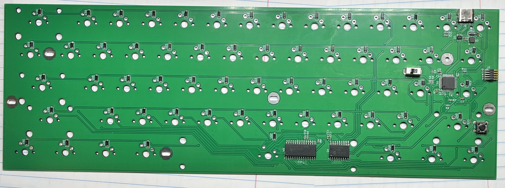
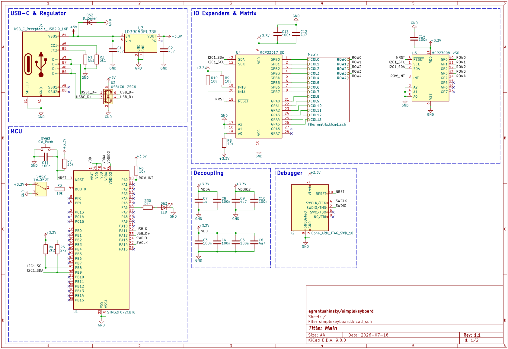
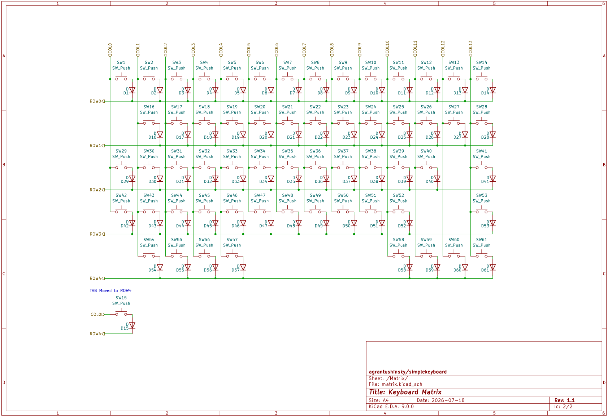
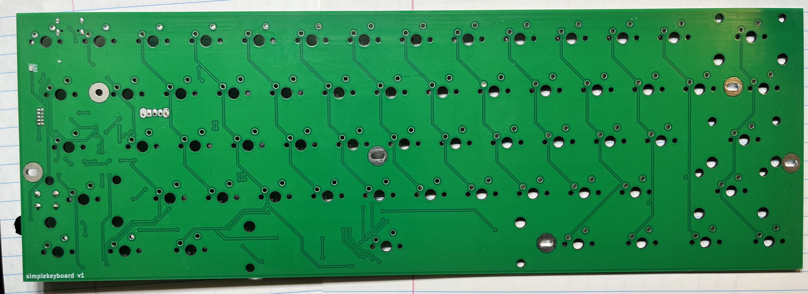

# simplekeyboard: 60% Mechanical Keyboard PCB
## Overview
A custom 60% mechanical keyboard 2-layer PCB built around an STM32 microcontroller and USB-C connectivity. The design utilizes I2C IO expanders to simplify matrix trace routing across the board. 

## Current Status (WIP)
Hardware bring-up is actively underway. I identified an error that swapped the SCL and SDA lines on one of the IO expanders. The next step is performing a physical trace bodge to fix the bus so I can finish validating the matrix polling logic.

## Schematics

*View the full schematic PDF: [schematics.pdf](assets/schematics.pdf)*

